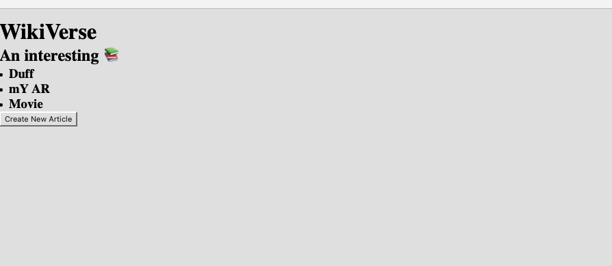
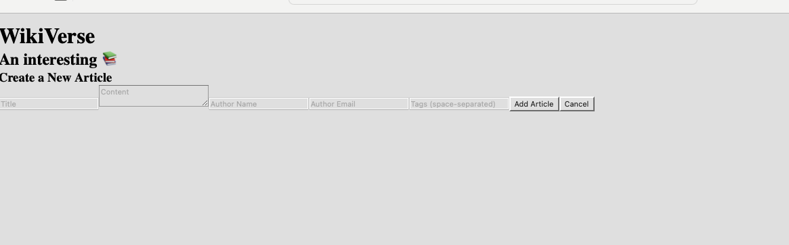
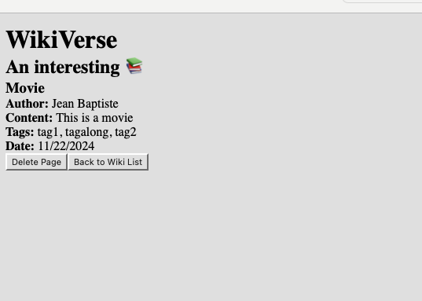

# Wikiverse
You are a creative content developer that needs a better system for publishing articles. You stumble across a great example called [Wikipedia](https://en.wikipedia.org/wiki/React_(JavaScript_library)) and decide to implement something like it, with a twist: You’ll build it as a Single Page Application, using React! ⚛️

We have already learned back end servers, so we get to start with a pre-built db connection via Sequelize, including express routes serving up the data via different REST verbs (GET, POST, PUT, and DELETE).

We have 3 database models:
- `Page`
- `User`
- `Tag`

## Getting Started
After forking and cloning down your repository, run the following:

1. `npm install`
2. `npm run seed`
3. `npm run server-dev`
4. In a seperate terminal, `npm run client-dev`

## Single Page View

The view is based on what would show up once the project would run

## Adding a Page

The view is based on what would show up once the project would run

## Delete Page

The view is based on what would show up once the project would run
